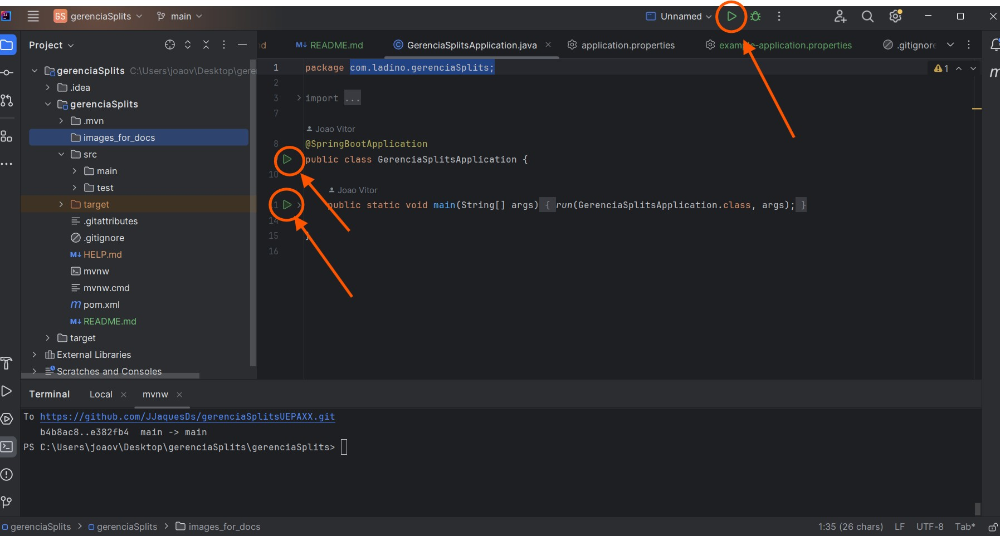
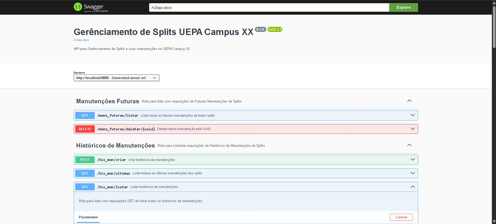

# API de Gerênciamento de Splits da UEPA Campus XX

## Descrição

Essa API foi criada para lidar com gerenciamento do mapeamento dos splits tanto em locais no campus
quanto em relação a suas manutenções

O sistema na fase atual permite:

* Cadastrar locais do campus e alocar os splits neles


* Registrar os e gerenciar os dados dos Splits


* Registrar e gerenciar dados de históricos de manutenções dos splits


* Visualizar as possíveis datas de futuras manutenções preventivas dos splits automaticamente


* Gerar relatórios Excel para controle do gerenciamento

## Tecnologias utilizadas

* Java 25
* Spring Boot
* Spring Web
* Spring Data JPA
* Hibernate
* PostgreSQL
* Jakarta Validation
* OpenAPI / Swagger
* Maven
* Apache POI

## Configuração do banco de dados para acesso ao sistema

Encontre o arquivo [example-application.properties](gerenciaSplits/src/main/resources/example-application.properties)
e no mesmo diretório crie um arquivo file com o nome "application.properties" e preencha conforme as especificações do example

Vale ressaltar que deve ser criado um banco de dados Postgres para ser preenchido em properties

As tabelas serão criadas a partir dos models/entidades automaticamente ao rodar a aplicação pela primeira vez

## Acesso ao sistema

Para acessar o sistema, você pode rodar tanto via IDE em [GerenciaSplitsApplication](gerenciaSplits/src/main/java/com/ladino/gerenciaSplits/GerenciaSplitsApplication.java) quanto via terminal da IDE ou nativo do PC.

Por padrão, na IDE já estamos na raiz do projeto, mas caso queira entrar pelo terminal do PC, precisa entrar na raiz do projeto



Via terminal, caso queira iniciar assim, execute:

```bash
mvn spring-boot:run
```

A aplicação ficará disponível em:

```
http://localhost:8080
```

---

# Swagger

A documentação da API pode ser acessada em:

```
http://localhost:8080/swagger-ui/index.html
```

---

Na documentação, a interface swagger open-api mostra todas as rotas e os verbos de requisições,
bem como exemplos de saídas e visualização das saídas dos json da API.

Ela permite mostrar uma interface amigável para manipulação do backend e testes das rotas



# Endpoints

Nessa sessão será demonstrado os endpoints da API e sua

## Splits:
Base URL: /splits

-------------------------------------------------------
1. **Criar Splits**

Cria um novo split no sistema.

Endpoint: POST /splits/criar

- Parâmetros: Nenhum

- Response: 200 OK

Request Body:

````json
{
  "rp": "00.000",
  "marca": "AGRATTO",
  "capacidadeBtu": "12.000 BTUS",
  "dataEntrada": "2024-07-30",
  "periodoManMes": "MENSAL",
  "localId": "3fa85f64-5717-4562-b3fc-2c963f66afa6"
}
````


  Campos:

  | Campo         | Tipo      | Obrigatório | Descrição                                  |
  |---------------|-----------|-------------|--------------------------------------------|
  | rp            | String    | Sim         | Registro patrimonial do equipamento        |
  | marca         | String    | Sim         | Marca do split                             |
  | capacidadeBtu | String    | Sim         | Capacidade em BTUS do split                |
  | dataEntrada   | LocalDate | Sim         | Data de entrada do split no campus         |
  | periodoManMes | Enum      | Sim         | Período de manutenção recomendado do split |
  | localId       | UUID      | Sim         | Uuid do local em que o split está alocado  |
 ----------------------------------------------------------------------------------------------
2. **Listar Todos os Splits**
   Retorna uma lista com todos os splits cadastrados no sistema.

Endpoint: GET /splits/listar

- Parâmetros: Nenhum

- Response: 200 OK

Request Body:

````json
[
  {
    "uuid": "3fa85f64-5717-4562-b3fc-2c963f66afa6",
    "rp": "00.001",
    "marca": "AGRATTO",
    "capacidadeBtu": "12.000 BTUS",
    "dataEntrada": "2024-07-30",
    "periodoManMes": "MENSAL",
    "local": "Auditório"
  },
  {
    "uuid": "4gb96g75-6828-5673-c4gd-3d074g77bgb7",
    "rp": "00.002",
    "marca": "ELGIN",
    "capacidadeBtu": "18.000 BTUS",
    "dataEntrada": "2024-08-15",
    "periodoManMes": "BIMESTRAL",
    "local": "Acessoria"
  }
]
````
-----------------------------------------------------------------
3. Atualizar Split
   Atualiza parcialmente as informações de um split existente através do UUID.

Endpoint: PATCH /splits/atualizar/{uuid}

- Parâmetro:


- uuid (obrigatório) - UUID do split a ser atualizado


- Exemplo: `PATCH /splits/atualizar/3fa85f64-5717-4562-b3fc-2c963f66afa6`


- Response: 200 OK


Request Body:

````json
{
    "uuid": "4gb96g75-6828-5673-c4gd-3d074g77bgb7",
    "rp": "00.002",
    "marca": "ELGIN",
    "capacidadeBtu": "18.000 BTUS",
    "dataEntrada": "2024-08-15",
    "periodoManMes": "BIMESTRAL",
    "local": "Acessoria"
  }
````

> [!Note]
> Você pode enviar apenas os campos que deseja atualizar, não precisa alterar todos

Possíveis erros:

- `404 Not Found` - Split não encontrado com UUID fornecido
- `400 Bad Request` - Dados inválidos na requisição

---------------------------------------------------------------------------------------
4. Deletar Split
   Remove um split do sistema através do UUID.

Endpoint: DELETE /splits/deletar/{uuid}

- Parâmetros:


- uuid (obrigatório) - UUID do split a ser deletado
Exemplo: `DELETE /splits/deletar/3fa85f64-5717-4562-b3fc-2c963f66afa6`


- Response: 204 No Content

Possíveis Erros:

- `404 Not Found` - Split não encontrado com o UUID fornecido

## Enum: PeriodoManMes
Valores possíveis para o período de manutenção:

- MENSAL - Manutenção mensal
- `BIMESTRAL` - Manutenção a cada 2 meses
- `TRIMESTRAL` - Manutenção a cada 3 meses
- `SEMESTRAL` - Manutenção a cada 6 meses
- `ANUAL` - Manutenção anual

## Observações
- Todos os UUIDs devem estar no formato padrão `UUID v4`
- As datas devem seguir o formato `ISO 8601 (YYYY-MM-DD)`
- O campo `localId` deve referenciar um local existente no sistema
- O campo local na resposta é retornado como string `(nome do local)` em vez do UUID

# Local:
Base URL:`/locais`

----------------------------------------------------------------------------------------------

1. Criar um local

Cria um novo local no sistema.

Endpoint: POST /locais/criar

- Parâmetros: Nenhum

- Response: 200 OK

Request Body:

````json
{
  "nomeLocal": "string"
}
````


Campos:

| Campo     | Tipo      | Obrigatório | Descrição                |
|-----------|-----------|-------------|--------------------------|
| nomeLocal | String    | Sim         | Nome do local registrado |
 ---------------------------------------------------------------------------------------

Possíveis Erros:

- `409 Conflict` - O local (nomeDoLocal) já existe

>[!NOTE]
> Caso erre o nome do local ao criar, não é possível alterá-lo, portanto você deve deletar esse local e criar um novo corretamente
----------------------------------------------------------------------------------------

2. **Listar Todos os Locais**
   Retorna uma lista com todos os locais cadastrados no sistema.

Endpoint: GET /locais/listar

- Parâmetros: Nenhum

- Response: 200 OK

Response Body:

````json
[
  {
    "localId": "3fa85f64-5717-4562-b3fc-2c963f66afa6",
    "nomeLocal": "Assessoria"
  },
  {
    "localId": "4gb96g75-6828-5673-c4gd-3d074g77bgb7",
    "nomeLocal": "Auditório"
  }
]
````
------------------------------------------------------------------------------------


3. Deletar Local
   Remove um split do sistema através do UUID.

Endpoint: DELETE /locais/deletar/{uuid}

- Parâmetros:


- uuid (obrigatório) - UUID do local a ser deletado
  Exemplo: `DELETE /locais/deletar/3fa85f64-5717-4562-b3fc-2c963f66afa6`


- Response: 204 No Content

Possíveis Erros:

- `404 Not Found` - Local não encontrado com o UUID fornecido

## Histórico de manutenções:
Base URL: `/his_man`

1. Criar histórico de manutenção

Cria um novo histórico de manutenção no sistema.

Endpoint: POST /his_man/criar

- Parâmetros: Nenhum

- Response: 200 OK

Request Body:

````json
{
  "dataManu": "2026-07-30",
  "tipoManu": "INSTALACAO",
  "tecnicoResponsavel": "João Vitor",
  "servicoRealizado": "Instalação do split",
  "observacoes": " A instalação ocorreu bem",
  "splitId": "3fa85f64-5717-4562-b3fc-2c963f66afa6"
}
````
Campos:

| Campo              | Tipo      | Obrigatório | Descrição                                                     |
|--------------------|-----------|-------------|---------------------------------------------------------------|
| dataManu           | LocalDate | Sim         | Data da manutenção                                            |
| tipoManu           | Enum      | Sim         | Tipo da manutenção no split                                   |
| tecnicoResponsavel | String    | Sim         | Nome do técnico responsável pela manutenção                   |
| servicoRealizado   | String    | Sim         | Descrição em poucas frases do serviço realizado na manutenção |
| observacoes        | String    | Não         | Observações da manutenção(pode ficar em branco)               |
| splitId            | UUID      | Sim         | Uuid do split em que a manutenção foi realizada               |
 ----------------------------------------------------------------------------------------------

## Enum tipoManu:
Tipos de manutenção nos splits realizados:

- `INSTALACAO` - Instalação de um split
- `DESINSTALACAO` - Desinstalação de um split
- `CORRETIVA` - Manutenção corretiva de erro em um split
- `PREVENTIVA` - Manutenção preventiva em um split
- `INSTALACAO_PREVENTIVA` - Instalação e correção de algo no split

---------------------------------------------------------------------------------------
2. **Listar Todos os Históricos de manutenções**
   Retorna uma lista com todos os históricos de manutenções cadastrados no sistema.

Endpoint: GET /his_man/listar

- Parâmetros: Nenhum

- Response: 200 OK

Response Body:

````json
[
  [
    {
      "historicoManuId": "3fa85f64-5717-4562-b3fc-2c963f66afa6",
      "dataManu": "2026-07-29",
      "tipoManu": "INSTALACAO",
      "tecnicoResponsavel": "João Vitor",
      "servicoRealizado": "Instalação do split",
      "observacoes": "null",
      "rp": "00.001",
      "local": "Assessoria"
    }
  ],
  {
    "historicoManuId": "4gb96g75-6828-5673-c4gd-3d074g77bgb7",
    "dataManu": "2026-07-30",
    "tipoManu": "PREVENTIVA",
    "tecnicoResponsavel": "João Vitor",
    "servicoRealizado": "Limpeza dos filtros",
    "observacoes": "Filtros muito sujos",
    "rp": "00.002",
    "local": "Auditório"
  }
]
````
----------------------------------------------------------------------------
2. **Listar Todos os Históricos de manutenções**
   Retorna uma lista com todos os históricos de manutenções cadastrados no sistema.

Endpoint: GET /his_man/listar

- Parâmetros: Nenhum

- Response: 200 OK

Response Body:

````json
[
  [
    {
      "historicoManuId": "3fa85f64-5717-4562-b3fc-2c963f66afa6",
      "dataManu": "2026-07-29",
      "tipoManu": "INSTALACAO",
      "tecnicoResponsavel": "João Vitor",
      "servicoRealizado": "Instalação do split",
      "observacoes": "null",
      "rp": "00.001",
      "local": "Assessoria"
    }
  ],
  {
    "historicoManuId": "4gb96g75-6828-5673-c4gd-3d074g77bgb7",
    "dataManu": "2026-07-30",
    "tipoManu": "PREVENTIVA",
    "tecnicoResponsavel": "João Vitor",
    "servicoRealizado": "Limpeza dos filtros",
    "observacoes": "Filtros muito sujos",
    "rp": "00.002",
    "local": "Auditório"
  }
]
````
>[!NOTE]
> Na resposta da requisição ao invés de mostrar o `splitId` é retornado o `rp` e o `local` do split.

----------------------------------------------------------------------------
3. **Listar histórico de manutenção pelo uuid**
   Retorna o histórico de manutenção cadastrados no sistema pelo uuid.

Endpoint: GET /his_man/listar/{uuid}

- Parâmetros: uuid (obrigatório) - UUID do histórico de manutenção a ser listado
  Exemplo: `GET /his_man/listar/3fa85f64-5717-4562-b3fc-2c963f66afa6`

- Response: 200 OK

Response Body:

````json
{
  "historicoManuId": "3fa85f64-5717-4562-b3fc-2c963f66afa6",
  "dataManu": "2026-07-29",
  "tipoManu": "INSTALACAO",
  "tecnicoResponsavel": "João Vitor",
  "servicoRealizado": "Instalação do split",
  "observacoes": "null",
  "rp": "00.001",
  "local": "Assessoria"
}
````
Possíveis Erros:

- `404 Not Found` - Histórico de manutenção não encontrado com o UUID fornecido
------------------------------------------------------------------------------------------------
4. **Listar Todas as últimas manutenções**
   Retorna uma lista com todos os históricos de últimas manutenções cadastrados no sistema.

Endpoint: GET /his_man/ultimas

- Parâmetros: Nenhum

- Response: 200 OK

Response Body:

````json
[
  {
    "splitId": "4gb96g75-6828-5673-c4gd-3d074g77bgb7",
    "rp": "00.001",
    "marca": "AGRATTO",
    "nomeLocal": "Assessoria",
    "dataUltimaMan": "2026-07-30"
  },
  {
    "splitId": "3fa85f64-5717-4562-b3fc-2c963f66afa6",
    "rp": "00.002",
    "marca": "MIDEA",
    "nomeLocal": "LAB INFORMÁTICA",
    "dataUltimaMan": "2026-07-30"
  }
]
````

------------------------------------------------------------------------------------
5. Deletar histórico de manutenção
   Remove um histórico de manutenção do sistema através do UUID.

Endpoint: DELETE /his_man/deletar/{uuid}

- Parâmetros:


- uuid (obrigatório) - UUID do histórico de manutenção a ser deletado
  Exemplo: `DELETE /his_man/deletar/3fa85f64-5717-4562-b3fc-2c963f66afa6`


- Response: 204 No Content

Possíveis Erros:

- `404 Not Found` - Local não encontrado com o UUID fornecido
----------------------------------------------------------------------------------
## Manutenções futuras
Base URL: `/manu_futuras`

1. **Listar todas as manutenções futuras dos splits**
   Retorna uma lista todas as manutenções futuras dos splits cadastradas no sistema.

Endpoint: GET /manu_futuas/listar

- Parâmetros: Nenhum

- Response: 200 OK

Response Body:

````json
[
  {
    "futurasManunId": "3fa85f64-5717-4562-b3fc-2c963f66afa6",
    "dataProxManu": "2027-01-30",
    "rp": "00.001",
    "local": "Protocolo"
  },
  {
    "futurasManunId": "4gb96g75-6828-5673-c4gd-3d074g77bgb7",
    "dataProxManu": "2026-12-17",
    "rp": "00.002",
    "local": "Lab Informática"
  }
]
````
>[!NOTE]
> As futuras manutenções são calculadas automaticamente conforme se cria ou se faz uma manutenção em um split.
------------------------------------------------------------------------------------------------------------------

2. **Deletar manutenção futura**
   Remove um registro manutenção futura de um split do sistema através do UUID.

Endpoint: DELETE /manu_futuras/deletar/{uuid}

Parâmetros:


- uuid (obrigatório) - UUID do histórico de manutenção a ser deletado
  Exemplo: `DELETE /manu_futuras/deletar/3fa85f64-5717-4562-b3fc-2c963f66afa6`


- Response: 204 No Content

Possíveis Erros:

- `404 Not Found` - Manutenção futura não encontrado com o UUID fornecido
--------------------------------------------------------------------------------------------

## Relatórios
Base URL: `/api/relatorios`

1. **Relatórios de cadastros das Splits**


Retorna uma planilha Excel com cadastro de todas as Splits no campus.

Endpoint: GET /api/relatorios/cadastros_splits

- Parâmetros: Nenhum

- Response: 200 OK

Response Body:
``cadastro_splits.xlsx``

2. **Relatórios de Histórico de manutenções das Splits**


Retorna uma planilha Excel com histórico de manutenções de todas as Splits no campus.

Endpoint: GET /api/relatorios/historico_descricao

- Parâmetros: Nenhum

- Response: 200 OK

Response Body:
``historico_descricao.xlsx``

3. **Relatórios de Histórico de Últimas Manutenções das Splits**


Retorna uma planilha Excel com histórico de últimas manutenções de todas as Splits no campus.

Endpoint: GET /api/relatorios/ultimas_manu

- Parâmetros: Nenhum

- Response: 200 OK

Response Body:
``ultimas_manu.xlsx``

4. **Relatórios de Datas de Todas as Últimas Manutenções das Splits**


Retorna uma planilha Excel com histórico de últimas manutenções de todas as Splits no campus.

Endpoint: GET /api/relatorios/datas_ultimas_manu

- Parâmetros: Nenhum

- Response: 200 OK

Response Body:
``datas_ultimas_manu.xlsx``
-----------------------------------------------------------------------------------------------------

> [!NOTE]
> Essas planilhas foram criadas conforme os modelos já utilizados pela administração do campus.
> Feitos com base nos modelos já em uso
-----------------------------------------------------------------------------------------------------
# Estrutura do projeto

````
gerenciaSplits
|__src
    |__main
        |__java
        |    |__com.ladino.gerenciaSplits
        |                              |__configurations (configurações)
        |                              |
        |                              |__controllers (lidar com as requisições REST da API, camada de entrada)
        |                              |
        |                              |__dtos (Data Object Transfer, lidar com as transferências de dados das entidades)
        |                              |                                     |
        |                              |                                     |_____requests (DTOs recebidos de requests para a API)
        |                              |                                     |
        |                              |                                     |_____responses (DTOs enviados aos usuários da API, com finalidade de receberem apenas os dados necessários)
        |                              |                                                |
        |                              |                                                |_____reports (DTOs para lidar com relatórios excel)
        |                              |                                                
        |                              |
        |                              |__exception (Excessões para mapear erros e respostas de requisições amigáveis aos usuários)
        |                              |
        |                              |__infra (Lidar com as classes de infraestrutura da API como exceptions e utilitários Excel)
        |                              |
        |                              |__mappers (Lidar com mudança de estrutura de objetos para entidades do banco de dados)
        |                              |
        |                              |__models (Classes que servem como padrão para persistência das entidades do banco de dados)
        |                              |
        |                              |__repository (Camada de repositório da api, única camada que conversa com o banco de dados)
        |                              |
        |                              |__service (Camada que lida com as regras de negócios do sistema e partes interessadas)
        |                               |
        |                               |
        |                               |__GerenciaSplitsApplication (Aplicação SpringBoot)
        |
        |__resources
                |__static
                |__templates
                 |
                 |__application.properties (Propriedades da aplicação Spring)
                 
````

# Fluxo de utilização

* Se não houver local para alocar um split, criar o local primeiro


* Locais não podem ser alterados, então se criar um local errado, excluir o local e criar novamente


* Criar um split associado a um local e se necessário, atualizar ou deletar o split


* Criar o histórico de manutenção de um split(após criar o split), e se necessário, atualizar ou deletar esse histórico


* Visualizar as futuras manutenções dos splits


* Gerar relatórios Excel 

> [!NOTE]
> Caso você crie um split, atualize a data da manutenção ou crie uma nova manutenção,
> será automaticamente atualizado a data da próxima manutenção preventiva
-----------------------------------------------------------------------------------------------------------------------

# Desenvolvimento

Para dúvidas sobre implementação ou integração:
- Email: [joaovitor.jaques.7748@gmail.com](mailto:joaovitor.jaques.7748@gmail.com)
- Email: [vitorianowaczyk@gmail.com](mailto:vitorianowaczyk@gmail.com)


- Github J.Vitor: https://github.com/JJaquesDs
- Github Vitoria: https://github.com/lindanowaczyk


### Reportar Problemas
Encontrou um bug ou tem uma sugestão? Sinta-se livre para mandar um email para gente!

-----------------------------------------------------------------------------------------------------------------------

Versão da API: `0.1.1`

Data da última grande atualização: `13/08/2026`

 © Direitos Reservados